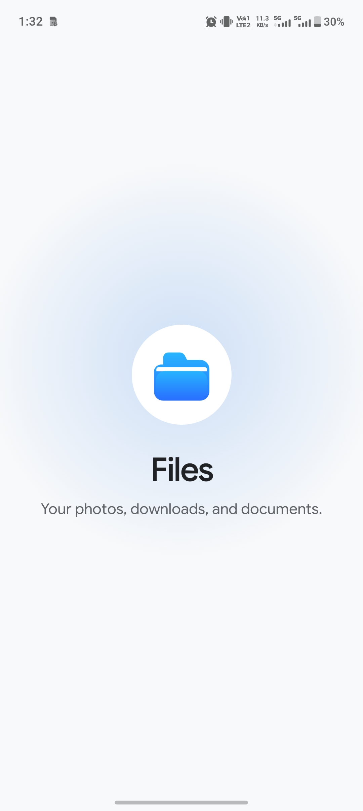
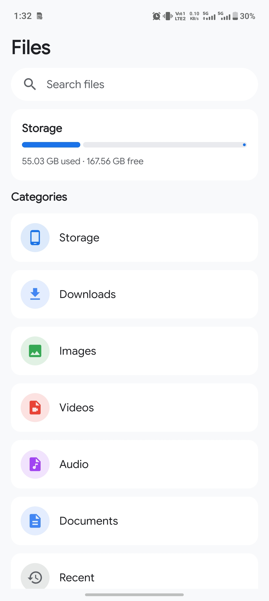
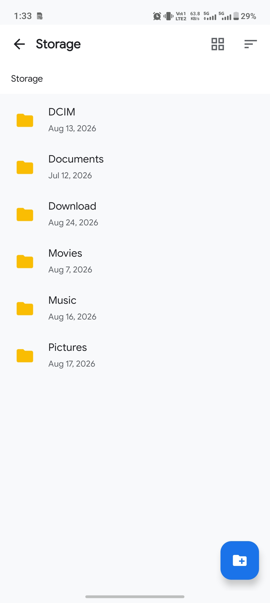
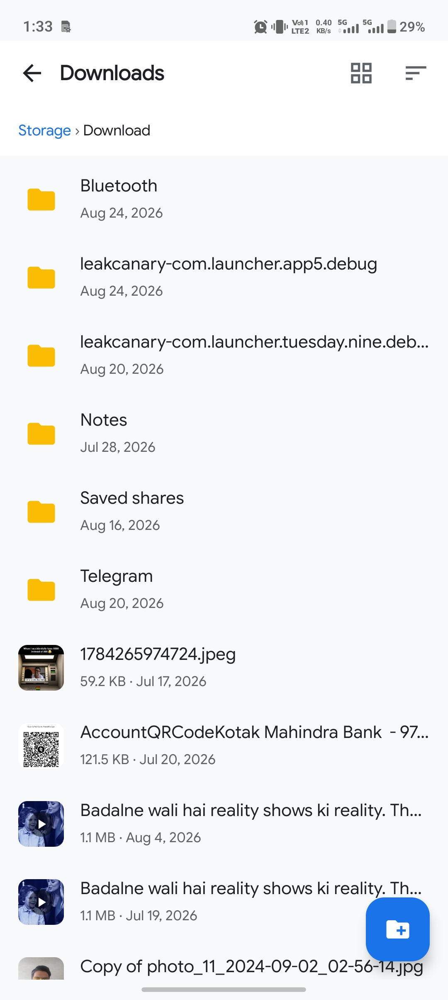
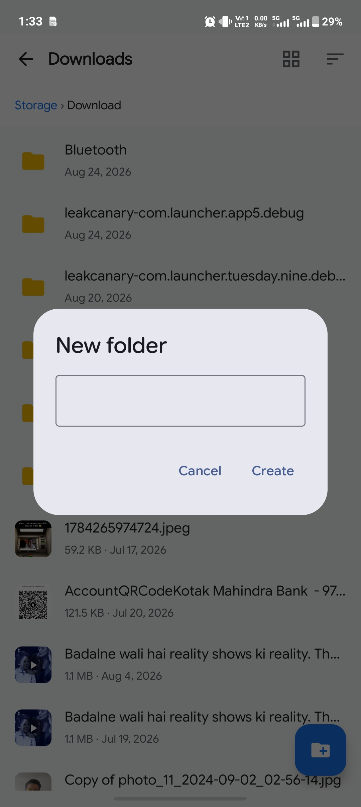
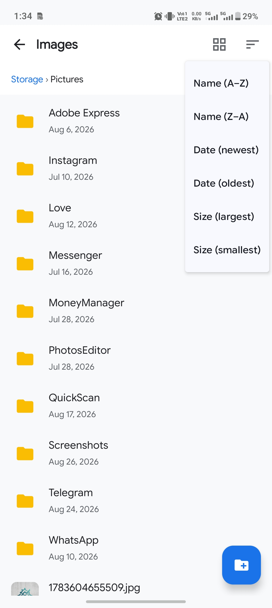

# Files App

A simple and modern Android file manager built with Kotlin and Jetpack Compose.

## Overview

Files App provides a clean interface for browsing device storage, accessing common file categories, and navigating through folders and files.

## Features

- Storage overview with used and available space
- Browse device folders and files
- Images, Videos, Audio and Documents categories
- Downloads and Recent files
- Grid and list view options
- Create new folders
- Clean and responsive UI

## Tech Stack

- Kotlin
- Jetpack Compose
- Material 3
- Android Storage APIs

## About

Designed and developed independently as a compact Android project, focusing on a clean user interface and a practical file-browsing experience.

## Screenshots

  
  
  

  
  
  

